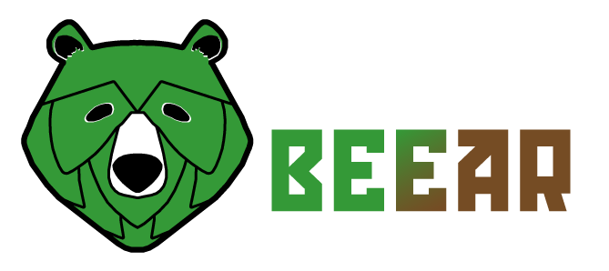

<div align="center">
  <a href="https://github.com/cdbschr/Beear">
    
  </a>

[](https://codeclimate.com/github/cdbschr/Beear/maintainability)
  
  <h1 align="center">Beear</h1>

  <p align="center">
    Brasserie fictive - Projet Kercode
    <br />
    <a href="<!-- Mettre le lien -->">Voir le site</a>
    ·
    <a href="https://github.com/cdbschr/Beear/issues">Reporter un Bug </a>
    ·
    <a href="https://github.com/cdbschr/Beear/issues">Faire une demande de Feature</a>
  </p>
</div>

<details>
  <summary>Sommaire</summary>
  <ol>
    <li>
      <a href="#a-propos-du-projet-">A propos du Projet</a>
      <ul>
        <li><a href="#technologies-utilisées-">Technologies utilisées</a></li>
      </ul>
    </li>
    <li>
      <a href="#mise-en-place">Mise en place</a>
      <ul>
        <li><a href="#pré-requis">Pré-requis</a></li>
        <li><a href="#installation">Installation</a></li>
        <li><a href="#identifiants">Identifiants</a></li>
      </ul>
    </li>
    <li><a href="#contact">Contact</a></li>
  </ol>
</details>

## A propos du Projet :

Beear est une brasserie fictive, l'intérêt était de mettre en place un maximum de connaissances apprises durant la formation Kercode. 
Le projet est un site vitrine avec un accès administrateur pour faire certaines modifications : 
  <ul>
    <li>Créer des utilisateurs (admin uniquement)</li>
    <li>Modifier les textes des bières (admin et editor)</li>
    <li>Lire les mails reçu venant du formulaire de contact (admin et editor)</li>
  </ul>

J'ai crée le logo en m'inspirant du houblon et d'une tête d'un ours. 
J'ai crée également les visuels, la maquette, afin de rendre plus chouette le site. 

Vient le choix des technologies, je suis parti sur un projet centré sur PHP afin de pouvoir modifier facilement et rendre dynamique le site.

J'espère que vous apprécierez ce projet et vous souhaite une bonne visite.

* Camille Debusscher

<p align="right">(<a href="#top">back to top</a>)</p>

### Technologies utilisées :

- HTML / CSS
- PHP (en structure MVC)
- SQL
- JavaScript

<p align="right">(<a href="#top">back to top</a>)</p>

## Mise en place
### Pré-requis
Personnellement j'ai utilisé Laragon avec la version de PHP 8.1.5 : 

* Laragon
```sh
https://laragon.org/download/
```

* PHP
```sh 
https://www.php.net/downloads.php
```

* Git
```sh
https://git-scm.com/downloads
```

J'ai également utilisé composer :

* composer
```sh
https://getcomposer.org/download/
```

J'ai utilisé HEIDISQL (intégré dans Laragon), pour la gestion de base de données.
Mon dump et mon UML sont dans le dossier 
```
app/Models/db
```

<p align="right">(<a href="#top">back to top</a>)</p>

### Installation
Pour l'installation, on va récupérer le repo en faisant dans votre terminal : 

* Git clone
```sh
git clone https://github.com/cdbschr/Beear.git
```

En allant dans le dossier, on va utiliser composer :

* Composer
```sh
composer install
```

<p align="right">(<a href="#top">back to top</a>)</p>

### Identifiants

Pour accèder au dashboard admin, cela se passe dans le footer, le lien : Connexion.

Identifiant : mail / password

L'administrateur : 
```
admin@admin.fr/admin
```

L'éditeur :
```
editor@editor.fr/editor
```

Utilisateur :
```
user@user.fr/user
```

<p align="right">(<a href="#top">back to top</a>)</p>

## Contact

Camille Debusscher - contact@camilledebusscher.tech
<p align="right">(<a href="#top">back to top</a>)</p>